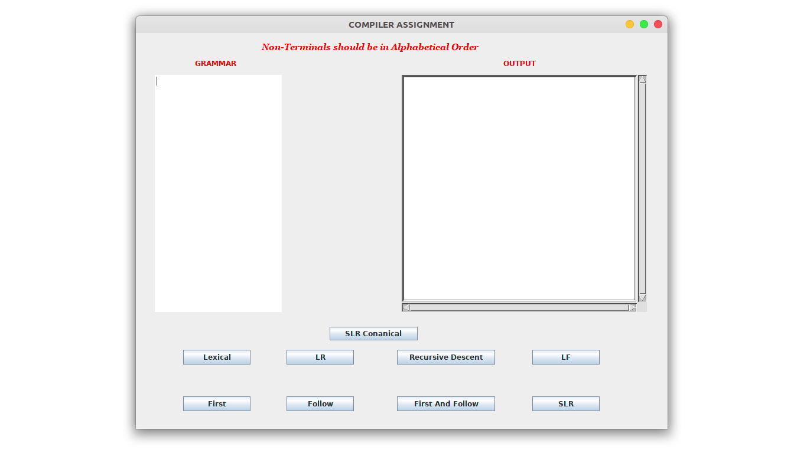
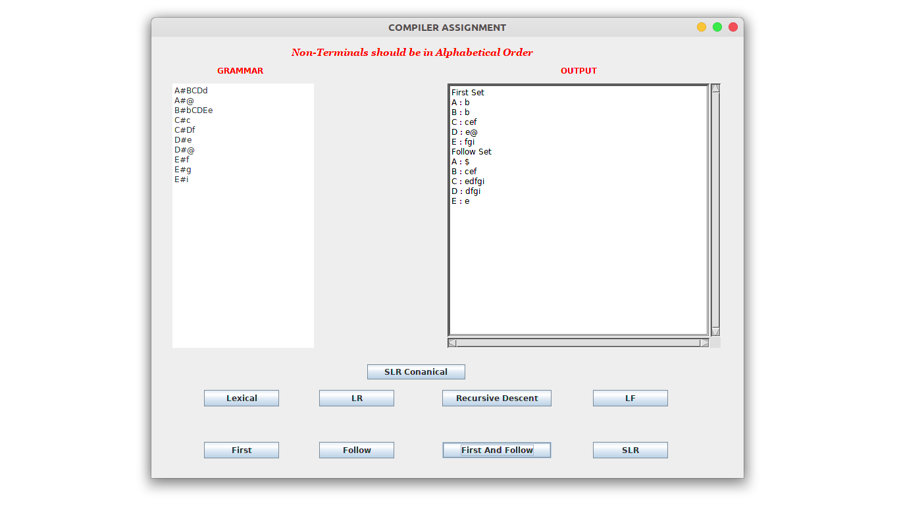
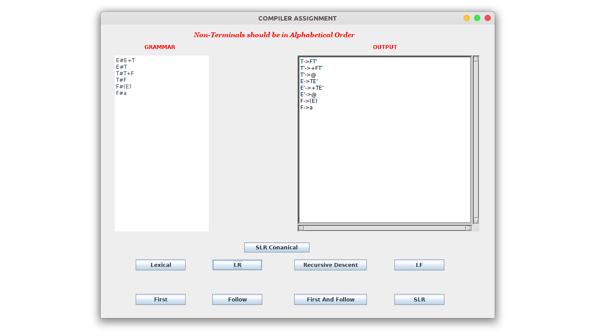
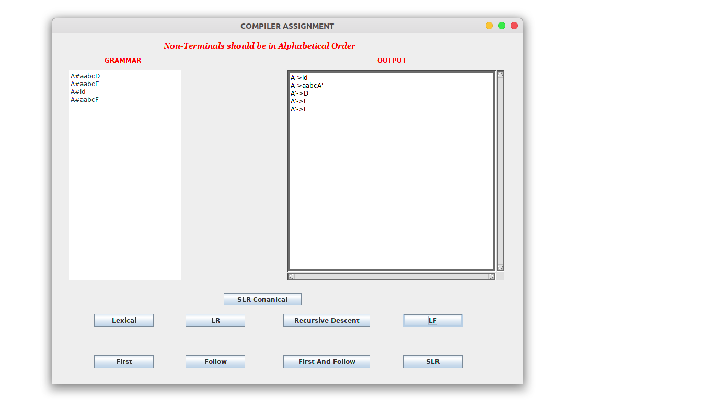
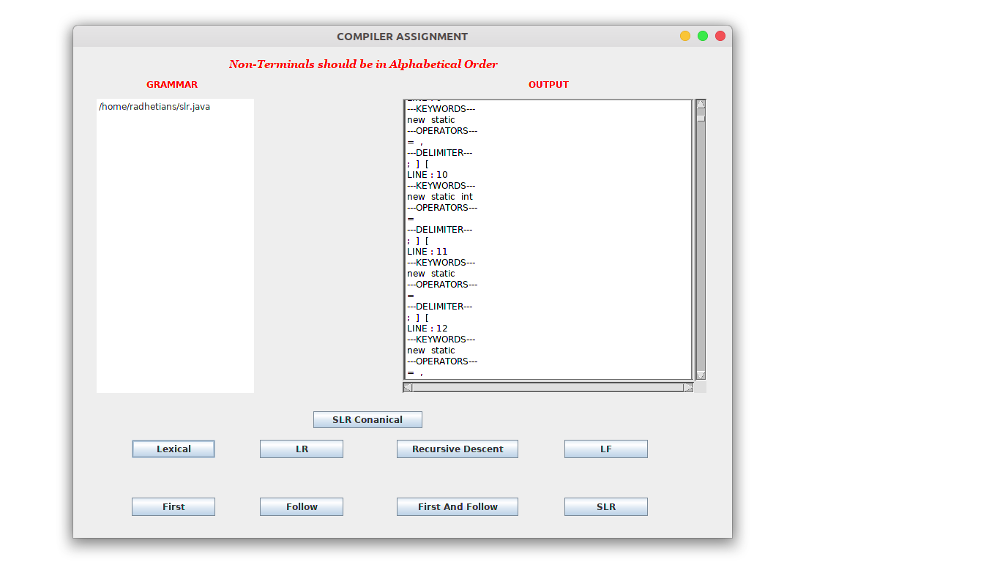
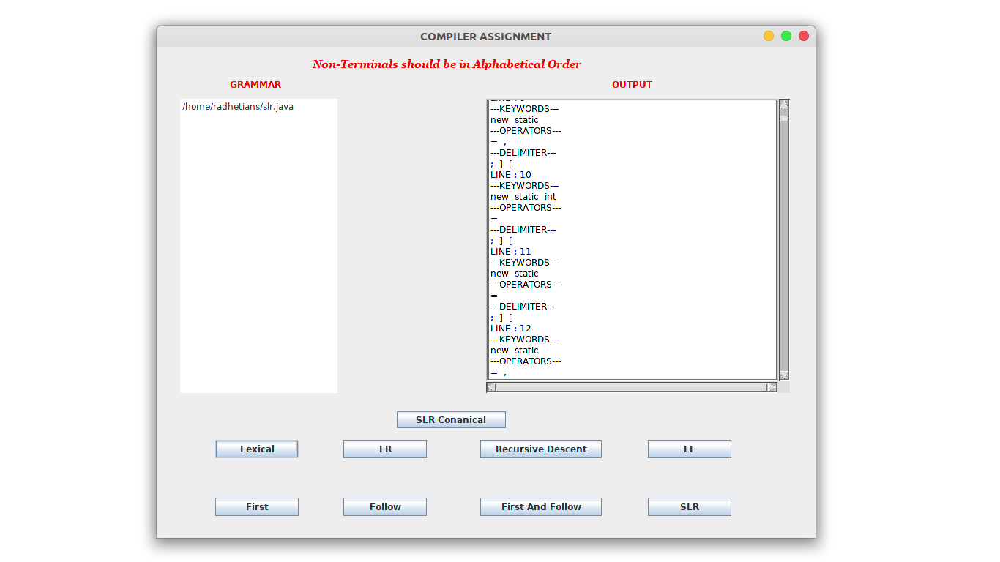
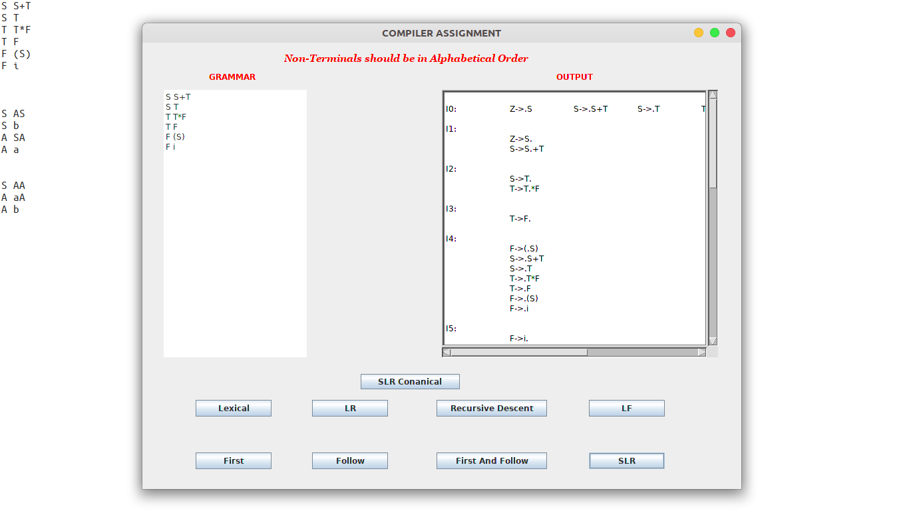
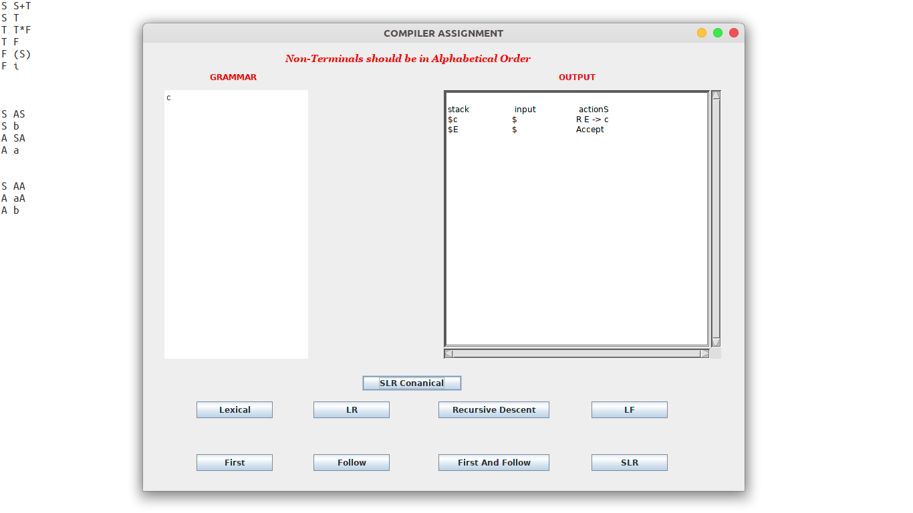

# Compiler Design Tool In Java
		
This is the Tool which can implement the phages of Compiler-Design which has been developed in Java programming lanuage.

# About

This is the tool which can calculate First, Follow and FirstAndFollow of given grammar, perform string validation of Recursive Descent parser, remove left recursion & left factoring from grammar, SLR string validation for fixed grammar,implementation of conanical collection of LR(0) items and SLR tabel, tokenized the given input file which can be in C/C++, JAVA, PYTHON and so on... 

  

  

# Add Features

The implemented tool has following features...

1. Added the feature that lexical analysis phage of compiler in which just need to provide the path of input file(file can be C/C++, JAVA, PYTHON, etc...) and this tool will be tokenized each in line of given input file.

2. Added the feature of removable of left recursion for the given input grammar.
 
3. Added the feature of removable of left factoring for the given input grammar.

4. Added the feature of string validation of Recursive Descent parser for the following fixed grammar...
		
		1.) E--> E + T
		2.) E--> T
		3.) T--> T * F
		4.) T--> F
		5.) F--> (E)
		6.) F--> a

		The string will be something like a+a$, a+a*a$, a+(a+a*a) and so on...	
		

5. Added the feature of calculation of first for the given input grammar.

6. Added the feature of calculation of follow for the given input grammar.

7. Added the feature of calculation of firstAndFollow simultaneously for the given input grammar.

8. Added the feature of string validation of SLR parser for the following fixed grammar...

		1.) E--> a E a
		2.) E--> b E b
		3.) E--> c
		
		The string wiil be something like c, aca,aabbcbbaa, bacab and so on...

9. Added the feature of Canonical collection of LR(0) items and Tabel of SLR parser for the given grammar.

## USAGE
   
   JAVA, Openjdk 11.0.4, Eclipse IDE, JAVA Swing, WindowBuilder.
   
## REQUIREMENT
 
### Environment:
  
   Source code to this project is coded in JAVA, with its GUI running in Swing-Designer and WindowBuilder.
 
 
### Packages:

   JDK 11.0.4, JRE, Swing-Designer, WindowBuilder.

 
# INSTALLATION 

## JDR for Ubuntu

	$ sudo apt-get update && apt-get upgrade
	$ sudo apt-get install default-jdk
	$ java --version

## JDR for Windown

   Download [JDK](https://www.oracle.com/technetwork/java/javase/downloads/index.html) .exe file go to jdk install directory double click on .exe file and follow the instructions. 

## Eclipse IDE
 
   Download [eclipse](https://www.eclipse.org/downloads/) IDE .exe file for Window or .tar.gz file for Ubuntu
   
### For Window

   Just double click on the .exe file and follow the instruction.

### For Ununtu

	$ tar xvf eclipse-inst-linux64.tar.gz
	$ cd eclipse-installer/
	$ chmod 777 eclipse-inst
	$ ./eclipse-inst
 
## Packages 

1. Open the eclipse IDE

2. Go to help section and select Install New Softwares..

3. select *year-http://download.eclipse.org/releases/2019-03 from add tag

4. Go to General Purpose Tools

5. And Install following packages...
		
		1.) Swing Designer
		2.) Swing Designer Documentation
		3.) SWT Designer
		4.) SWT Designer Core
		5.) SWT Designer Documentation
		6.) SWT Designer SWT_AWTSupport
		7.) SWT Designer XWTSupport(requires Eclipse WTP/WST)
		8.) WindowBuilder Core
		9.) WindowBuilder Core Documentation
		10.) WindowBuilder Core UI
		11.) WindowBuilder Java Core
		12.) WindowBuilder XML Core(requires Eclipse WTP/WST)
		

# Clone repository :

	$ git clone https://github.com/RadheTians/Compiler-Design-Tool-In-Java.git
	$ cd MCQ-System-System

# Running locally :
 
1. Open the eclipse IDE.

2. Import the project directory on eclipse IDE

3. And run window.java file from src/doc directory.

# How to Use

This tool has nine buttons, one input field and one output field and their working precedure is following...

1. Provide the path of input file(File can be C/C++, Python, Java, etc...) in input text field which is at the left and press Lexical button after doing this, tool will be tokenized the given input file.

2. Provide the grammar in input text field which has left recursion and press LR button after doing this, tool will be removed left recursion from given grammar.

3. Provide the string for fixed grammar and press Recursive Descent button after doing this, recursive descent parser will be parsed the string and tell the status of given string(i.e Accept or Reject) and the grammar is following...

		1.) E--> E + T
		2.) E--> T
		3.) T--> T * F
		4.) T--> F
		5.) F--> (E)
		6.) F--> a

		The string will be something like a+a$, a+a*a$, a+(a+a*a) and so on...	

4. Provide the grammar in input text field which has left factoring and press LR button after doing this tool will be removed left factoring from given grammar.

5. Provide the grammar in input text field and press First button after doing this, tool will be calculated first of the given grammar.

6. Provide the grammar in input text field and press Follow button after doing this, tool will be calculated follow of the given grammar.

7. Provide the grammar in input text field and press FirstAndFollow button after doing this, tool will be calculated first and follow of the given grammar.

8. Provide the string for fixed grammar and press SLR button after doing this, SLR parser will be parsed the string and tell the status of given string(i.e Accept or Reject) and the grammar is following...

		1.) E--> a E a
		2.) E--> b E b
		3.) E--> c
		
		The string wiil be something like c, aca,aabbcbbaa, bacab and so on...

9. Provide the grammar in input text field and press SLR Canonical button after doing this, tool will be calculated canonical collection of LR(0) items and construct SLR table.

<b>Attention:-</b> The separater between left and right in Context-Free-Grammar(CFG) is <b>"#"</b> and the epsilan has been represented by <b>"@"</b>.  

  

  

  

  

  

  

